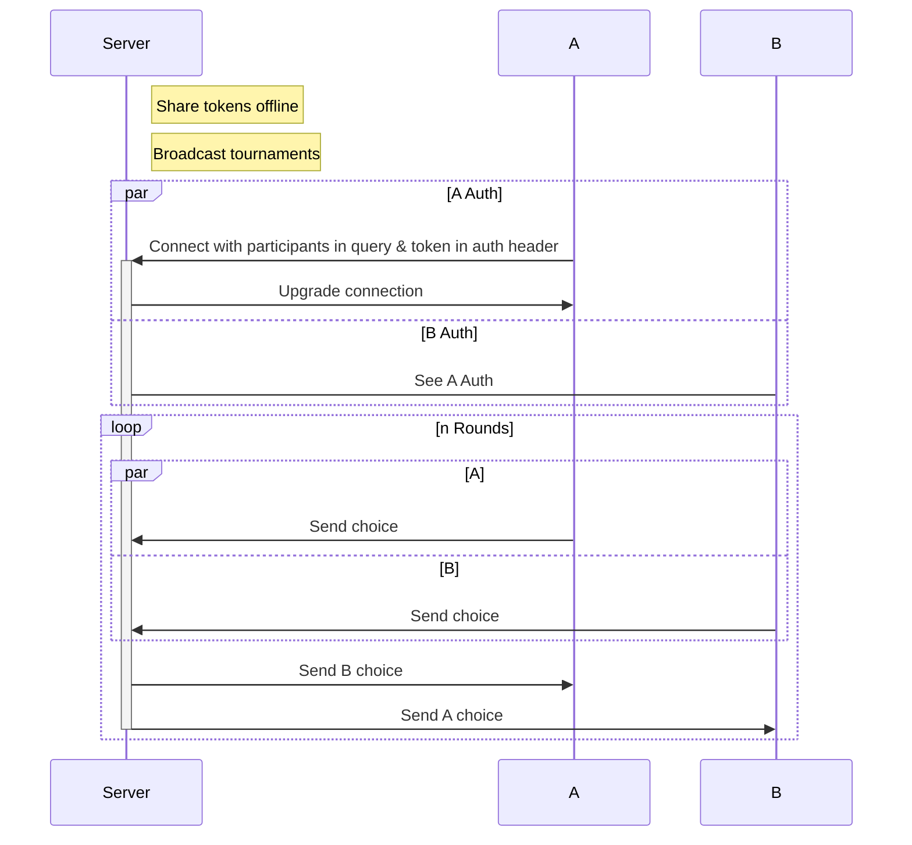

# What is the Iterated Prisoner's Dilemma?

The Iterated Prisoner's Dilemma is a classic game in game theory that explores the complexities of cooperation and competition. Here’s a brief overview:
Basic Scenario: Two players must decide whether to cooperate (C) or defect/betray (B). The outcomes depend on both players' choices:
- If both cooperate, they receive moderate rewards.
- If one defects while the other cooperates, the defector receives a higher reward while the cooperator gets nothing.
- If both defect, they receive minimal rewards.

Iterated Format: Unlike a single round, this tournament will consist of multiple rounds, allowing players to adjust their strategies based on previous interactions. This setup emphasizes the importance of trust, reputation, and strategic thinking.

# Tournament Details
Date and Time: [Insert date and time]
Location: [Insert location or virtual meeting link]
Format: Each participant will play against every other participant in a series of rounds. Points will be awarded based on the outcomes of each round, and the player with the highest score at the end will be declared the winner.

# What to Prepare
- Understand the Rules: Familiarize yourself with the basic rules of the game. A detailed rulebook will be provided closer to the tournament date.
- Strategy Development: Think about your approach—will you prioritize cooperation or adopt a more competitive stance?
- Have Fun: While we aim for competitive play, remember that this is also about learning and enjoying the experience!

I encourage all participants to engage actively and share their insights throughout the tournament. This is not just a competition; it's an opportunity for collaboration and learning from one another.

If you have any questions or need further clarification, please feel free to reach out.
Looking forward to seeing you there!

# Process flow for participants

The tournament will be held through a websocket server. You can join a tournament with the tournament id, group name and token which will be issued to you on the day itself.

Once connected, send your initial choice to the server. The first round will begin once both participants have connected.

After each round, your opponents choice wwill be send to you for you to decide on your next choice. Once you have recieved the results of the previous round, you will minimally have 200ms to send the next choice. Failure to to send a choice before the round ends consitututes forfeitting the round.



# Sample code

```python
from websockets.sync.client import connect

# Parameters will be issued during the tournament
url = "wss://ipd.sctd.gov.sg"
tournament = "dcf8536d-0c1b-467c-af25-7d09d5f39971"
participant = "group1"
token = "jnGnWueNqxjqKJgiq9FeZXYVOkPjFPdj"

# Connect to websocket server
with connect(f"{url}/{tournament}?participant={participant}", additional_headers={'authorization': token}) as websocket:
    # Once connected, immediately send your first choice
    # The choice only accepts "C" (Collaborate) or "B" (Betray)
    # Any other choices forfiets the round
    websocket.send("C")
    while True:
        # You will recieve the opponent's last choice from the server when the round is over
        # This will be a "C" or "B"
        message = websocket.recv()

        # Your strategy here:
        # In this case we just use the opponent's last choice as our next choice
        choice = message
        
        # Send your choice within the time limit or you will forfiet the round
        websocket.send(message)
```

## Troubleshooting

Ensure your Python version is >= 3.8

Ensure that `websockets` [package](https://pypi.org/project/websockets/) is installed. `pip install websockets`
