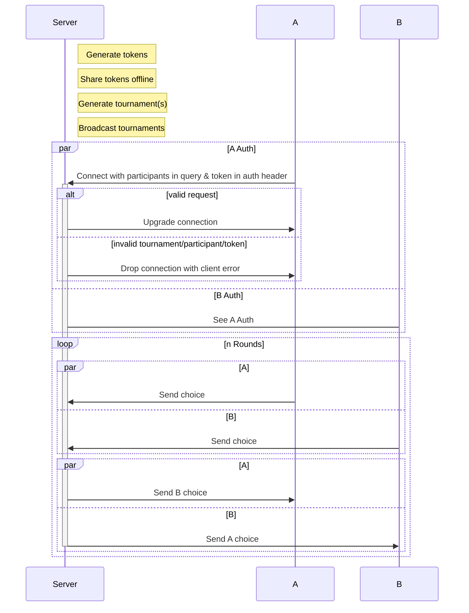

# Iterated Prisoner's Dilemma Websocket Server

This repository exists to facilitate hosting a Iterated Prisoner's Dilemma tournament without allowing unvalidated code from running on the organizer's infrastructure.

While other implementations exist, they rely on the organizer running the strategy.

By exposing a websocket based interface, the organizer's exposure is greatly reduced.

One limitation of this approach is that the games are dependent on the participant's input, possibly stalling out a game if one participant does not respond.
To address this, each round has a timeout.
If a participant fails to provide a response within the timeout, their turn is forfeit.

From testing, 200ms a round with 2 python clients appears to be fairly reliable. 
There are some dropouts but its not common.

## Usage

1. Prepare a participants file.

example: 
```
participant,token
group1,
group2,
group3,
...
```

2. Run `python generate_participants.py` to generate tokens for participants.

Particpiants file is hardcoded at `participants/participants.csv`

3. Run websocket server with `python main.py`

4. Generate tournament with `python create_tournament.py <participant-A> <participant-B>`

Tournaments are hardcoded to be output to `tournaments/<tournament_uuid>.csv`

5. Setup is now complete, clients can join by opening a websocket connection to the server with participant in the query string and token in the authentication header.

i.e. 
`?participant=<participant>`
`'Authorization: <token>`

Tournament will start once both participants and run until its over. 

Repeat step 4 and 5 for each tournament.

## Process flow




# References

https://github.com/oldgalileo/bastille

Containerized runners communicating through stdin and stdout. 

https://github.com/Axelrod-Python/Axelrod

Python based prisoner's dilemma tournament w/ metrics.

https://github.com/Mark-MDO47/PrisonDilemmaTourney

Python based prisoner's dilemma tournament
